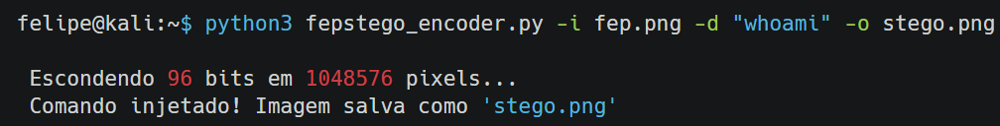
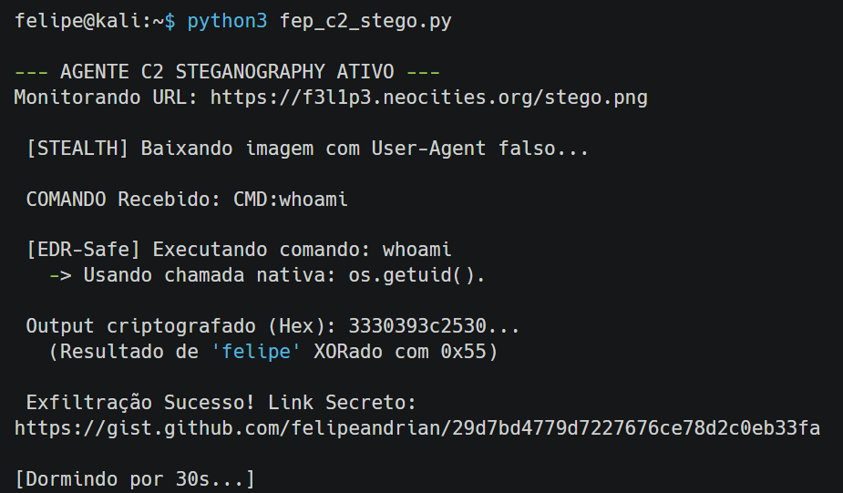
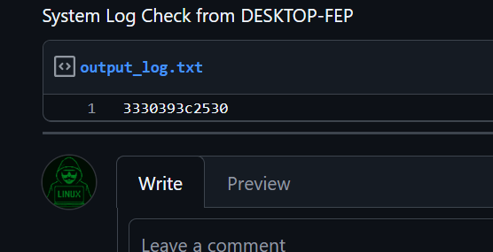
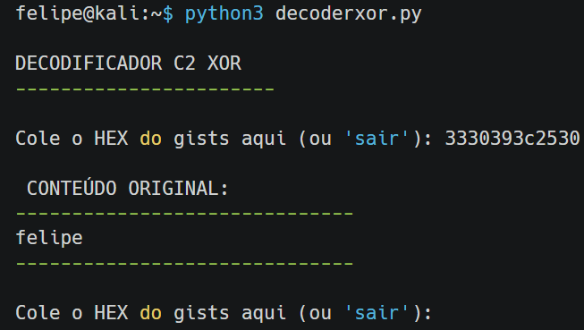

#  FEP C2 STEGO: Agente de Comando e Controle via Esteganografia

### Arquitetura Asimétrica de Dead Drop sobre Canais Criptografados


-brightgreen.svg)


> **⚠️ Aviso Legal (Disclaimer):**
> Este software é uma **Prova de Conceito (PoC)** desenvolvida estritamente para fins de pesquisa acadêmica em segurança ofensiva e engenharia de redes. O autor não encoraja, sanciona ou apoia o uso desta ferramenta para acesso não autorizado a sistemas. O utilizador assume total responsabilidade legal pelas suas ações.

---

## Visão Geral e Arquitetura

O **FEP C2 STEGO** é um framework C2 de baixa frequência que utiliza canais encobertos de alta reputação. O objetivo é demonstrar a exfiltração de dados e o controle remoto sem abrir portas ou usar tráfego facilmente bloqueável.


<p align="center">
  
  <br>
  <em>Injetando o payload na .png com LSB Steganography</em>
</p>

<p align="center">
  
  <br>
  <em>Imagem stego.png com o payload e steganografia</em>
</p>

<p align="center">
  
  <br>
  <em>Terminal do Controlador (C2) exfiltração via canal encoberto de alta reputação e criptografado</em>
</p>

<p align="center">
  
  <br>
  <em>Dados recebidos em hex com criptografia xor no gists</em>
</p>

<p align="center">
  
  <br>
  <em>Dados decodificados</em>
</p>


### Fluxo Híbrido (Split-Flow)
O sistema opera em um modelo *Pull-Based*: o Agente verifica o Dead Drop (a imagem) para buscar comandos e envia o resultado para um canal de exfiltração separado (GitHub Gists).

```mermaid
sequenceDiagram
    Note over Hacker, Agente: FASE 1: INJEÇÃO DE COMANDO (LSB/Image)
    Hacker->>Image Host: Upload 'dead_drop.png' (Comando Oculto)
    Agente->>Image Host: HTTPS GET (Polling por comando)
    Note over Agente: Decodificação LSB (Extrai "CMD:whoami")
    
    Note over Agente: Processamento Interno (Native API)
    
    Note over Hacker, Agente: FASE 2: EXFILTRAÇÃO DE DADOS
    Agente->>GitHub API: HTTPS POST [Payload: XOR(Resultado) em JSON]
    GitHub API->>Hacker: Gist criado (Notificação/Polling)
````

-----

##  Os Três Pilares da Evasão

### 1\. Canal de Comando (LSB Steganography)

  * **Mecanismo:** O comando é injetado no **Least Significant Bit (LSB)** do canal Vermelho dos pixels da imagem.
  * **Vantagem:** O comando viaja escondido em um arquivo de imagem (`Content-Type: image/png`), o que é inofensivo para sistemas de DPI (Deep Packet Inspection).

### 2\. Execução Furtiva (Living off the Land)

  * **Mecanismo:** O agente utiliza APIs nativas do Python (`os.getlogin`, `os.listdir`) para executar comandos de reconhecimento sem criar processos filhos (`cmd.exe` ou `/bin/sh`).
  * **Evasão:** Evita o gatilho principal de alertas EDR (Endpoint Detection & Response) que monitoram a criação de shells por scripts.

### 3\. Exfiltração via Gists (Trusted Domain)

  * **Mecanismo:** O resultado é enviado via HTTPS POST para **`api.github.com/gists`** (porta 443), utilizando um Personal Access Token (PAT).
  * **Vantagem:** O tráfego utiliza um domínio de alta reputação que não pode ser bloqueado, disfarçando a exfiltração de dados como tráfego normal de API. O resultado é criptografado com XOR para proteger o conteúdo.

-----

##  Instalação e Uso Prático

### 1\. Instalação e Pré-requisitos

O Agente requer as bibliotecas `requests` e `Pillow` para manipulação de imagem e rede.

```bash
# 1. Clonar o repositório
git clone https://github.com/felipeandrian/fep-c2-stego.git
cd fep-c2-stego

# 2. Instalar dependências
pip install requests Pillow
```

### 2\. Configuração Crítica (PAT)

O Agente precisa de um Personal Access Token (PAT) do GitHub com o escopo `gist` para autenticar o upload de dados.

```bash
# O agente lerá esta chave da variável de ambiente GITHUB_PAT
export GITHUB_PAT="ghp_seu_token_aqui_12345"
```

### 4\. Criação do Comando (Encoder)

```bash
# ARQUIVO: fepstego_encoder.py
# Cria a imagem injetada e salva como payload_command.png
python3 fepstego_encoder.py -i base.png -d "whoami" -o payload_command.png
```

### 5\. Iniciar o Agente (Vítima)

O agente fará *polling* da URL da imagem a cada 30 segundos, verificando se há um comando novo.

```bash
# Iniciar o agente
python3 fep_c2_stego.py
> URL da imagem PNG: [LINK_DA_IMAGEM_COM_COMANDO_ESCONDIDO]
```

### 6\. Ciclo de Comando e Coleta (Hacker)

1.  **Comando:** O operador usa o script `fepstego_encoder.py` para injetar o comando na imagem e hospeda-a em uma URL pública.
2.  **Aguardar:** O agente baixa, executa o comando (`whoami`, `ls`), criptografa o resultado e envia um novo Gist secreto.
3.  **Coleta:** O operador monitora sua página de Gists (`gist.github.com/seuusuario`) para ver o `output_log.txt` e usa o `decoderxor.py` para descriptografar o Hex.

-----

## Blueprint de Operacionalização

Embora o agente **FEP C2 STEGO** prove a viabilidade da esteganografia LSB e do Polling Assíncrono, ele falha nos princípios de persistência e não-atribuição que são mandatórios para operações de nivel APT.

Esta seção detalha as modificações arquiteturais necessárias para contornar a deteção avançada (EDR/AI/Threat Hunting).

### 1. Código Base e Evasão de Host (Abandonar o Python)

A maior fraqueza do projeto é a sua dependência de um interpretador Python.

* **Problema:** O `python.exe` é um binário grande, facilmente rastreado pelo inventário de software e vigiado por EDRs.
* **Upgrade APT:** O agente seria totalmente reescrito em **Rust, C, ou Go (Golang)**.
    * **Vantagem:** O binário final seria minúsculo (KBs) e não dependeria de DLLs externas (como `pip install requests`). Isso reduz drasticamente a **pegada de memória** e a taxa de deteção por *Heurística* do Antivírus.

### 2. Infraestrutura: Migração para Trusted SaaS (OAuth C2)

O GitHub Gists é um alvo fácil de bloquear (IOC conhecido). A solução é mover o *dead drop* para um host inbloqueável.

* **Problema:** Gists são rastreados e, embora o HTTPS seja seguro, o destino (`api.github.com/gists`) é suspeito.
* **Upgrade APT:** Utilizar a **Microsoft Graph API**.
    * **Mecanismo:** O Agente usaria um **Token OAuth Complexo** (roubado ou gerado) para fazer upload do resultado para o **OneDrive, SharePoint ou Rascunhos do Outlook**.
    * **Vantagem:** O tráfego para `graph.microsoft.com` é essencial para o fluxo de trabalho corporativo. O analista de segurança não pode bloquear esse domínio sem derrubar o e-mail e os documentos da empresa.

### 3. Criptografia e Integridade (Adeus, XOR)

O XOR (`0xAA`) é uma falha de segurança primária; se descoberto, todo o histórico de comunicação é comprometido.

* **Problema:** O XOR não oferece **autenticação** (o Agente não sabe se o comando foi adulterado por um terceiro).
* **Upgrade APT:** Criptografia Simétrica de Grau Militar: **AES-256 em modo GCM (Galois/Counter Mode)**.
    * **Vantagem:** O GCM fornece **Integridade Criptográfica**. Se um bit for alterado no trânsito (por ruído ou um ataque ativo), o agente detecta a adulteração e recusa a execução do comando, protegendo a OpSec da operação.

### 4. Persistência e Evasão de Comportamento

* **Persistência:** Em vez de usar um loop `while True` simples, a ferramenta seria integrada a um mecanismo legítimo (ex: *WMI Event Subscription* no Windows ou *systemd timer* no Linux) para persistência em caso de *reboot*.
* **Controle de Estado:** O *polling* da URL seria agendado em intervalos aleatórios maiores (ex: 4 a 6 horas) e acionado por eventos de utilizador (ex: o utilizador moveu o mouse) para mimetizar o comportamento de um utilizador legítimo.

---

## 📄 Licença

Distribuído sob a licença MIT. Veja `LICENSE` para mais informações.

Copyright (c) 2025 **Felipe Andrian Peixoto**

```

---
